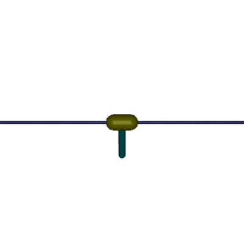
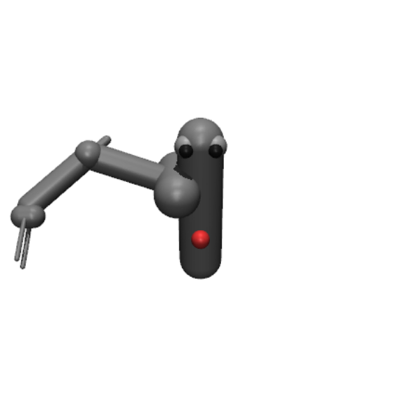
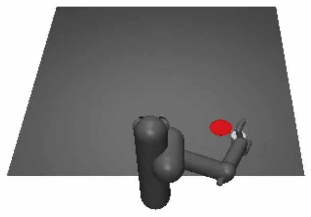
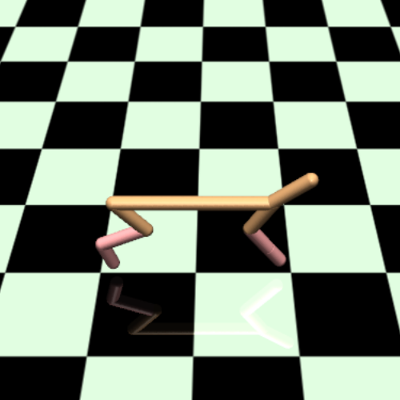

# Deep Reinforcement Learning in a Handful of Trials using Probabilistic Dynamics Models

<p align=center>

</p>

<p align="center">
  <a href="https://arxiv.org/abs/1805.12114">View on ArXiv</a>
  |
  <a href="https://sites.google.com/view/drl-in-a-handful-of-trials/home">View website</a>
</p>

**Abstract:** Model-based reinforcement learning (RL) algorithms can attain excellent sample
efficiency, but often lag behind the best model-free algorithms in terms of asymptotic performance,
especially those with high-capacity parametric function approximators, such as deep networks.
In this paper, we study how to bridge this gap, by employing uncertainty-aware dynamics models.
We propose a new algorithm called probabilistic ensembles with trajectory sampling (PETS) that
combines uncertainty-aware deep network dynamics models with sampling-based uncertainty propagation.
Our comparison to state-of-the-art model-based and model-free deep RL algorithms shows that our
approach matches the asymptotic performance of model-free algorithms on several challenging
benchmark tasks, while requiring significantly fewer samples (e.g. 25 and 125 times fewer samples
than Soft Actor Critic and Proximal Policy Optimization respectively on the half-cheetah task).

## Requirements

The provided environments require MuJoCo 1.31. Other dependencies can be installed with `pip install -r requirements.txt`.

Alternatively, we have included a Dockerfile for your convenience; this repository will be found in `/root/handful-of-trials` within the image.
We have also provided a prebuilt image; to use the image, run `docker pull kchua/handful-of-trials`.

A few notes on the provided Docker image:
1. Note that using MuJoCo requires that the user have a key; to use the Docker image, ensure that the key is mounted so that it is located at `/root/.mujoco/mjkey.txt`.
2. This image allows the scripts to access user GPUs; consequently, the image must be launched using `nvidia-docker`.

## Running Experiments

Experiments for a particular environment can be run using:

```
python scripts/mbexp.py
    -env    ENV       (required) The name of the environment. Select from
                                 [cartpole, reacher, pusher, halfcheetah].
    -ca     CTRL_ARG  (optional) The arguments for the controller
                                 (see section below on controller arguments).
    -o      OVERRIDE  (optional) Overrides to default parameters
                                 (see section below on overrides).
    -logdir LOGDIR    (optional) Directory to which results will be logged (default: ./log)
```

To run experiments with default arguments to reproduce our results, only specify the environment (and optionally a log directory). For example: `python scripts/mbexp.py -env halfcheetah`.

Results will be saved in `<logdir>/<date+time of experiment start>/`.
Trial data will be contained in `logs.mat`, with the following contents:

```
{
    "observations": NumPy array of shape
        [num_train_iters * nrollouts_per_iter + ninit_rollouts, trial_lengths, obs_dim]
    "actions": NumPy array of shape
        [num_train_iters * nrollouts_per_iter + ninit_rollouts, trial_lengths, ac_dim]
    "rewards": NumPy array of shape
        [num_train_iters * nrollouts_per_iter + ninit_rollouts, trial_lengths, 1]
    "returns": Numpy array of shape [1, num_train_iters * neval]
}
```

#### Rendering

A script for visualizing a rollout with a trained model is also provided for convenience, and can be run using `python scripts/render.py`. Usage is similar to `mbexp.py`, with an additional argument `-model_dir <path to directory containing saved model files>`. The provided directory must contain `model.mat` and `model.nns`.

### Controller Arguments

To specify controller arguments `-ca`, choose among the following options:

```
model-type : The model that will be used. Select from [D, P, DE, PE]. Defaults to PE.
             D indicates deterministic networks, P indicates probabilistic networks, and E indicates
             ensembling.
prop-type  : The propagation method that will be used. Select from [E, DS, TS1, TSinf, MM].
             Defaults to TSinf. E indicates deterministic, DS is distribution sampling, TS*
             are trajectory sampling methods, and MM is moment matching.
opt-type   : The optimizer that will be used to select action sequences. Select from [Random, CEM].
             Defaults to CEM (cross-entropy method).
```

For example, to learn the halfcheetah task using an ensemble of probabilistic NNs for the dynamics model, TSinf propagation, and a CEM optimizer, use: `python scripts/mbexp.py -env halfcheetah -ca model-type PE -ca prop-type TSinf -ca opt-type CEM`.

### Overrides

To specify an override, find the desired value in the dictionary below (can only override values at the ends).
Then, add the following argument: `-o <dictionary path> <value>`.

For example, the script does not record videos automatically. To record five videos at every training iteration,
add `-o exp_cfg.log_cfg.nrecord 5`.

Defaults are indicated in `[]` if they are constant across environments. Environment-specific defaults can be found in `dmbrl/config/<env-name>.py`.
Furthemore, the structure can change depending on script arguments; argument-specific branches are in `()`.

```
 ├──exp_cfg                                 - Experiment script configuration.
 │    ├── sim_cfg                           - Simulation configuration.
 │    │    ├── task_hor                     - Task horizon.
 │    │    ├── stochastic                   - If True, makes environment stochastic through action
 │    │    │                                  noise. [False]
 │    │    └── noise_std                    - Action noise standard deviation.
 │    ├── exp_cfg                           - Experiment configuration.
 │    │    ├── ntrain_iters                 - Number of training iterations.
 │    │    ├── nrollouts_per_iter           - Number of rollouts done in the environment
 │    │    │                                  for every training iteration. [1]
 │    │    └── ninit_rollouts               - Number of initial rollouts done before first train()
 │    │                                       call to controller. [1]
 │    └── log_cfg                           - Logger configuration.
 │         ├── nrecord                      - Number of rollouts to record for every training
 │         │                                  iteration. [0]
 │         └── neval                        - Number of controller evaluations for every training
 │                                            iteration. [1]
 └── ctrl_cfg (MPC)                         - Controller configuration.
      ├── per                               - How often the action sequence is reoptimized. [1]
      ├── prop_cfg                          - Propagation method configuration.
      │    ├── model_pretrained             - If model constructor creates a pretrained model. [False]
      │    ├── model_init_cfg               - Model construction parameters; see (BNN.py/NN.py/TFGP.py
      │    │                                  for details).
      │    ├── model_train_cfg              - Model training parameters; see (BNN.py/NN.py/TFGP.py
      │    │                                  for details).
      │    └── npart                        - Number of particles to be used in particle propagation
      │                                       methods. [20]
      ├── opt_cfg                           - Optimization configuration.
      │    ├── plan_hor                     - Planning horizon.
      │    └── cfg                          - Optimizer configuration.
      │         ├── popsize    (Random/CEM) - Number of candidate solutions sampled (per iteration
      │         │                             for CEM).
      │         ├── max_iters  (CEM)        - Maximum number of optimization iterations.
      │         ├── num_elites (CEM)        - Number of elites used to refit Gaussian.
      │         ├── epsilon    (CEM)        - Minimum variance for termination condition.
      │         └── alpha      (CEM)        - Coefficient used to weigh current mean and previous mean.
      └── log_cfg                           - Controller logging configuration.
           ├── save_all_models              - If True, saves models at every training iteration.
           │                                  [False]
           ├── log_traj_preds               - If True, saves trajectory prediction mean and variance.
           │                                  [False]
           └── log_particles                - If True, saves all particle trajectory predictions.
                                              [False]
```

## Plotting Results

Example plotting code is given in `plotter.ipynb`, and can be run using Jupyter (`jupyter notebook`).

## Contact

To ask questions or report any issues, please open an issue on the [Issues](https://github.com/kchua/handful-of-trials/issues) page.
